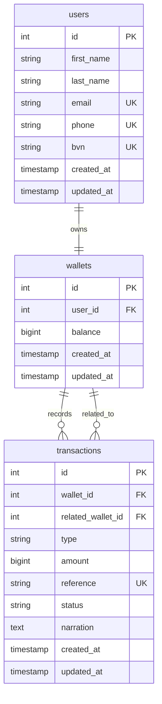

# Demo Credit Wallet Service

Node.js and TypeScript wallet API built for the Lendsqr backend engineering assessment.

## Overview

Demo Credit is a lending product that needs wallet functionality for loan disbursement and repayments. This service provides an MVP API where users can create accounts, receive wallet funding, withdraw funds, and transfer funds to other users.

The service also checks the Lendsqr Adjutor Karma blacklist during onboarding. A user with a Karma record is rejected before an account and wallet are created.

## Tech Stack

- **Node.js LTS**: JavaScript runtime for the API server.
- **TypeScript**: adds static typing for safer backend code.
- **Express**: HTTP server and routing framework.
- **KnexJS**: query builder, migrations, and transaction handling.
- **MySQL**: relational database for users, wallets, and transactions.
- **Zod**: request payload validation.
- **Jest and Supertest**: unit and integration testing.

## Architecture

```txt
src/
  app.ts
  server.ts
  config/
  controllers/
  database/
  middlewares/
  repositories/
  routes/
  services/
  utils/
tests/
  helpers/
  integration/
  unit/
```

The application follows a layered structure:

- **Routes** define resource paths and attach middleware.
- **Controllers** translate HTTP requests into service calls.
- **Services** contain business rules such as blacklist checks, balance checks, and wallet transaction scope.
- **Repositories** isolate Knex database queries.
- **Migrations** define the database schema.
- **Middleware** handles validation, faux authentication, async errors, and final error responses.

## Database Design

### E-R Diagram



### Relationship Summary

```txt
users 1 -> 1 wallets
wallets 1 -> many transactions through transactions.wallet_id
wallets 1 -> many transactions through transactions.related_wallet_id
```

### Tables

#### users

Stores onboarded users.

| Column | Type | Notes |
| --- | --- | --- |
| id | integer | Primary key |
| first_name | string | Required |
| last_name | string | Required |
| email | string | Required, unique |
| phone | string | Required, unique |
| bvn | string | Required, unique |
| created_at | timestamp | Managed by Knex |
| updated_at | timestamp | Managed by Knex |

#### wallets

Stores one wallet per user.

| Column | Type | Notes |
| --- | --- | --- |
| id | integer | Primary key |
| user_id | integer | Required, unique, foreign key to users.id |
| balance | bigint | Required, defaults to 0 |
| created_at | timestamp | Managed by Knex |
| updated_at | timestamp | Managed by Knex |

#### transactions

Stores immutable wallet movement records.

| Column | Type | Notes |
| --- | --- | --- |
| id | integer | Primary key |
| wallet_id | integer | Wallet affected by the transaction |
| related_wallet_id | integer | Other wallet in a transfer, nullable |
| type | string | funding, withdrawal, transfer_debit, transfer_credit |
| amount | bigint | Amount moved |
| reference | string | Unique transaction reference |
| status | string | Defaults to successful |
| narration | text | Human-readable transaction note |
| created_at | timestamp | Managed by Knex |
| updated_at | timestamp | Managed by Knex |

## Transaction Scoping

Wallet mutations are wrapped in Knex database transactions so the database commits all related changes together or rolls them back together.

For example, a transfer does all of these in one transaction:

```txt
Lock sender and receiver wallet rows
Check sender balance
Debit sender wallet
Credit receiver wallet
Create transfer debit transaction
Create transfer credit transaction
Commit
```

Wallet reads used for funding, withdrawal, and transfer use `FOR UPDATE` row locks inside the transaction. This prevents concurrent requests from reading the same wallet balance and spending it twice. Transfer wallet rows are locked in a deterministic order to reduce deadlock risk when two users transfer to each other at the same time.

## Faux Authentication

The assessment does not require a full authentication system, so protected wallet endpoints use a simple token format:

```txt
Authorization: Bearer <userId>
```

Example:

```txt
Authorization: Bearer 1
```

The auth middleware reads the user ID from the bearer token and attaches it to the request.

## Karma Blacklist Check

User creation checks the Lendsqr Adjutor Karma service before writing the user to the database.

Onboarding flow:

```txt
Validate request payload
Check for existing email, phone, or BVN
Call Adjutor Karma blacklist endpoint
Reject blacklisted identity
Create user and wallet in one database transaction
```

If the Adjutor API key is missing or the service is unavailable, onboarding fails with a service error instead of silently creating the user.

## API Endpoints

### Health Check

```http
GET /health
```

Response:

```json
{
  "status": "ok",
  "service": "Credit Wallet Service"
}
```

### Create User

```http
POST /users
```

Body:

```json
{
  "firstName": "Divine",
  "lastName": "Test",
  "email": "divine@example.com",
  "phone": "08011111111",
  "bvn": "12345678901"
}
```

### Get Current User Wallet

```http
GET /wallets/me
Authorization: Bearer 1
```

### Fund Wallet

```http
POST /wallets/fund
Authorization: Bearer 1
```

Body:

```json
{
  "amount": 10000
}
```

### Withdraw From Wallet

```http
POST /wallets/withdraw
Authorization: Bearer 1
```

Body:

```json
{
  "amount": 2000
}
```

### Transfer Funds

```http
POST /wallets/transfer
Authorization: Bearer 1
```

Body:

```json
{
  "receiverUserId": 2,
  "amount": 3000
}
```

## Environment Variables

Create a `.env` file in the project root.

```env
NODE_ENV=development
PORT=3000

DB_HOST=127.0.0.1
DB_PORT=3306
DB_USER=root
DB_PASSWORD=
DB_NAME=demo_credit_wallet
TEST_DB_NAME=demo_credit_wallet_test

ADJUTOR_BASE_URL=https://adjutor.lendsqr.com/v2
ADJUTOR_API_KEY=your_adjutor_api_key
```

## Running Locally

Install dependencies:

```bash
npm install
```

Create the development and test databases in MySQL:

```sql
CREATE DATABASE demo_credit_wallet;
CREATE DATABASE demo_credit_wallet_test;
```

Run migrations:

```bash
npm run knex -- migrate:latest
```

Start the development server:

```bash
npm run dev
```

Run the compiled production build locally:

```bash
npm run build
npm start
```

## Testing

Run all tests:

```bash
npm test
```

The test suite covers:

- validation schema behavior
- Karma service behavior with mocked API responses
- user creation failures
- wallet funding
- wallet withdrawal
- wallet transfer
- wallet transaction records
- insufficient balance and invalid transfer cases

## MVP Decisions and Tradeoffs

- Full authentication was intentionally omitted because the assessment allows faux token authentication.
- Wallet balances are stored for quick reads, while transaction records preserve movement history.
- Amounts are stored as integers to avoid floating-point money errors.
- Adjutor failures block onboarding because the requirement says blacklisted users must never be onboarded.
- Transaction rows are recorded only after successful wallet updates in the same transaction scope.

## Deployment

Deployment URL:

```txt
TODO: Add deployed API URL
```

Target naming format from the assessment:

```txt
https://<candidate-name>-lendsqr-be-test.<cloud-platform-domain>
```
